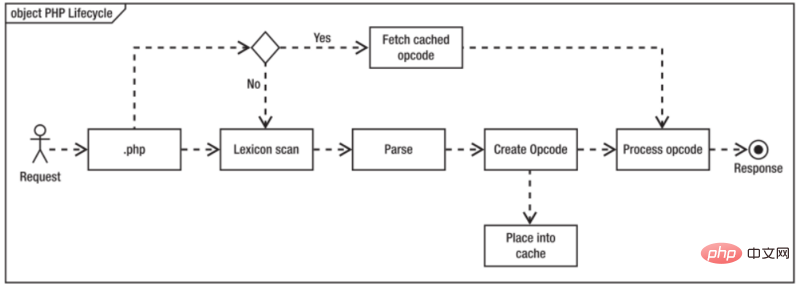

# 1.4

--

## 概述

优化`opcode`参数.


Zend引擎必须从文件系统读取文件、扫描其词典和表达式、解析文件、创建要执行的计算机代码（称为Opcode）,最后执行Opcode。每一次请求PHP脚本都会执行一遍以上步骤，如果PHP源代码没有变化，那么Opcode也不会变化，显然没有必要每次都重行生成Opcode，结合在Web中无所不在的缓存机制，我们可以把Opcode缓存下来,以后直接访问缓存的Opcode岂不是更快，启用Opcode缓存之后的流程图如下所示：



### 针对现有环境的修改

**如果还需要使用旧版本镜像, 也可以使用 1.3版本镜像**

因为修改了`opcode`的优化策略, 现在是常驻缓存, 除非环境重新启动. 但是针对开发环境的修改对php文件的修改不会产生效果, 所以**必须在启动环境前添加**.

需要在`config.dev.php`中添加

```php
opcache_reset();
```

某些情况下, 如在`docker-compose`模式下跑代码, 如果需要更新缓存, 可以:

```
# 重启 phpfpm 容器
docker restart xxxx-phpfpm
``` 

### 配置参数说明

```
opcache.enable=1
opcache.enable_cli=1
opcache.opcache.memory_consumption=256
opcache.interned_strings_buffer=8
opcache.opcache.max_accelerated_files=11000
opcache.huge_code_pages=0
opcache.validate_timestamps=0
opcache.revalidate_freq=0
opcache.save_comments=0
opcache.fast_shutdown=1
```

#### opcache.enable=1

启用opcache

#### opcache.memory_consumption=256

使用共享内存大小

#### opcache.interned_strings_buffer=8

字符串缓存大小

#### opcache.max_accelerated_files=11000

最大缓存文件数量

#### opcache.fast_shutdown=1

出现异常，立即释放全部内存

#### opcache.revalidate_freq=0

Opcache 会在一定时间内去检查文件的修改时间, 这里设置检查的时间周期, 默认为 2, 单位为秒

#### opcache.validate_timestamps=0

改配置值用于重新验证脚本，如果设置为 0(性能最佳)，需要手动在每次 PHP 代码更改后手动清除 OPcache. 如果你不想要手动清除, 可以将其设置为 1 并通过 opcache.revalidate_freq 配置重新验证间隔，这可能会消耗一些性能，因为需要每隔 x 秒检查更改.

#### opcache.save_comments=0

是否禁用文件中的注释

#### opcache.huge_code_pages=0

启用或者禁用将 PHP 代码（文本段）拷贝到 HUGE PAGES 中。 此项配置指令可以提高性能，但是需要在 OS 层面进行对应的配置.

#### opcache.enable_file_override=0

如果启用，则在调用函数 file_exists()， is_file() 以及 is_readable() 的时候， 都会检查操作码缓存，无论文件是否已经被缓存。 如果应用中包含检查 PHP 脚本存在性和可读性的功能，这样可以提升性能。 但是如果禁用了 opcache.validate_timestamps 选项， 可能存在返回过时数据的风险.
